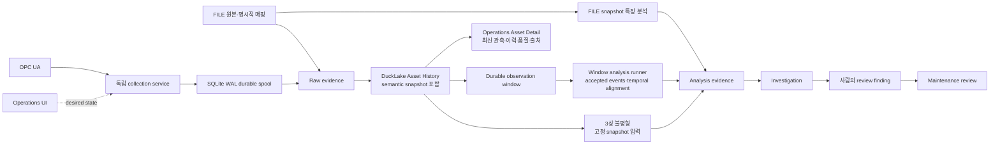

# Architecture Overview

이 문서는 `industrial-phm-framework`의 현재 reference architecture를 설명합니다.
특정 설비나 특정 데이터셋을 구조 자체에 고정하지 않고 책임과 데이터 흐름을 기준으로 유지합니다.

대표 구조는 다음 질문에 답하는 것을 우선합니다.

1. 설비 데이터는 어떤 근거를 보존하며 설비 이력으로 모이는가?
2. 분석은 어떤 입력으로 실행되고 어떤 근거를 남기는가?
3. 사람은 어디에서 근거를 조사·검토하고 판단하는가?
4. 연구·평가 흐름은 production 흐름과 어떻게 분리되는가?

`CanonicalTimeSeries`의 현재 가정, XJTU-SY에 과적합되지 않기 위한 확장 규칙, 조직 제공 데이터나 대상 운영 source에서 확인할
quality·provenance·security boundary는
[`canonical-data-contract.md`](canonical-data-contract.md)를 기준으로 검토합니다. Canonical contract는 모든 산업
데이터를 미리 포괄하는 universal schema가 아니라 구체적인 source가 추가될 때 공통 의미만 유지하는 adapter/core
boundary입니다.

AI-Hub 239 raw power data는 별도의 streaming reader로 null·중복·원본 local time을 보존합니다.
명시적 source/asset/timezone binding을 거쳐 FILE raw evidence와 공통 Asset History에 적재하며,
Operations Asset Detail은 같은 history에서 FILE/OPC UA 관측을 bounded range query로 조회합니다.
Raw ingestion과 analysis projection, identity와 measurement semantics의 경계는
[ADR-0007](../adr/0007-preserve-raw-measurements-before-analysis-projection.md)에 정리합니다.
CanonicalTimeSeries의 finite rectangular 계약은 유지합니다.

OPC UA collection, durable spool, DuckLake Asset History와 live/backfill의 ownership·restart contract는
[`live-acquisition-ducklake-v1.md`](live-acquisition-ducklake-v1.md)와
[`live-acquisition-reliability-v1.md`](live-acquisition-reliability-v1.md)에 있습니다. 이 문서는 component
책임과 contract를 설명하며 지원 상태나 계획을 소유하지 않습니다. 구현 지원 범위는
[현재 지원 상태](../status.md)를 기준으로 확인합니다.

## 1. 시스템 아키텍처


README와 이 문서는 같은 대표 그림을 사용합니다. 대표 그림은 구현 부품이 아니라 책임 단계를 보여주며,
SQLite·DuckLake·spool·window coordinator 같은 구성 요소는 아래 상세 runtime에서 설명합니다. 원본은 편집
가능한 `assets/system-architecture.svg`이고 PNG는 그 렌더링입니다. 그림의 PHM 분석 항목은 책임 단계를
표현하며 특정 capability의 지원 여부를 주장하지 않습니다. 지원 여부는 [현재 지원 상태](../status.md)를
따릅니다.

- **Data Sources**: OPC UA subscription과 FILE(prepared CSV, AI-Hub raw archive 등). 명시적 source/asset/
  measurement-point binding 없이 설비 identity를 추정하지 않습니다.
- **Acquisition & History**: 원본 관측을 raw evidence로 보존하고 공통 Asset History(asset, measurement point,
  channel, event time, value, source, quality, provenance)에 모읍니다. FILE과 OPC UA가 만나는 공통 경계입니다.
- **PHM Analysis & Evidence**: Asset History에서 alignment·exclusion·deduplication policy를 명시한 analysis
  projection(`CanonicalTimeSeries` 등)을 만들고, 입력 범위·버전·결과를 재현할 수 있는 분석 근거를 남깁니다.
  Raw evidence와 analysis input을 섞지 않습니다([ADR-0007](../adr/0007-preserve-raw-measurements-before-analysis-projection.md)).
- **Operations & Review**: Asset Detail 중심으로 관측·이력·품질·출처·evidence를 보여주고, Investigation,
  사람이 만든 review finding, maintenance review 기록을 남깁니다. Source monitoring("데이터가 들어오는가")과
  asset monitoring("설비에서 무엇을 검토해야 하는가")을 하나의 상태로 합치지 않습니다.
- **Human Decision**: 운영·정비 판단은 사람이 내립니다. 시스템은 근거를 제공하며 설비 제어나 정비 작업을
  자동 실행하지 않습니다.

### Production path와 Research path

```text
Production                                   Research
OPC UA / FILE / historian                    공개 데이터셋 · raw measurements
  -> raw evidence -> Asset History             -> model / rule / analysis
  -> analysis projection -> analysis           -> result
  -> evidence -> finding / investigation         ↕ provider annotation (예: AI-Hub label)
  -> human review                              -> evaluation / comparison
```

운영 source에는 일반적으로 분석용 label이 함께 오지 않습니다. 모든 production capability는 label 없이 동작해야 합니다.
AI-Hub의 기동패턴·SOH label 같은 provider annotation은 research 평가 비교에만 사용하며 production 입력,
`AssetHealth`, `OperatingState`, `OperationalFinding`, maintenance decision이나 verified ground truth로
승격하지 않습니다. 비교 대상의 종류는 [terminology](../terminology.md#7-observation-and-reference-vocabulary)의
vocabulary로 구분합니다.

첫 label-free 분석 capability는 [3상 불평형](phase-unbalance-capability.md)입니다.

### 상세 runtime



Operations UI의 desired collection state와 실제 collection process ownership은 분리합니다. 3상 불평형 같은
capability는 history snapshot 또는 finalized window처럼 명시적으로 고정된 입력을 소비하고, temporal
alignment와 eligibility policy를 evidence에 남깁니다. Live window 분석은 collection service와 별도 runner
책임으로 두어 수집 생명주기와 분석 실패를 결합하지 않습니다. 로컬 DuckLake 접근의 coordination과
저장·적재 성능 근거는 [`measurement-history-evolution.md`](measurement-history-evolution.md)에 기록합니다.

### 연구 reference 구현

Isolation Forest, LSTM Autoencoder, RUL Ridge와 temporal LSTM은 research path의 reference implementation이며
공통 PHM 코어나 production capability를 정의하지 않습니다. 새로운 모델도 동일한 contract/evaluation 경계를
지키고 기존 evidence gap을 실제로 해결하는 경우에 추가합니다.

## 2. 모델 학습 및 평가 (research path)


그림은 입력 데이터에서 전처리·특징 생성, 데이터 분할, 모델 학습, 분석 결과 생성, 모델 평가, 비교·선택으로
이어지는 전체 실험 수명주기를 보여줍니다. 실제 split strategy는 deployment scenario와 데이터 구조에 맞게
asset/run/time/site/cohort 같은 leakage boundary를 명시적으로 정합니다. XJTU-SY의 bearing-run split을 모든
industrial dataset의 공통 split 규칙으로 일반화하지 않습니다.

그림의 `전처리 및 특징 생성`은 파이프라인 책임을 나타내는 개념 단계입니다. scaler, normalizer, threshold,
feature statistics처럼 데이터로부터 학습되는 상태는 split 이후 **train 범위에서만 fit**하고 validation/test에는
학습된 상태만 적용해야 합니다. 따라서 도식의 좌→우 순서를 "전체 데이터에 먼저 fit한다"는 의미로 해석하지
않습니다.

모델 평가는 모델 구현과 분리합니다. Isolation Forest와 LSTM Autoencoder를 비교할 때도 같은 split과 같은
평가 프로토콜을 사용합니다. anomaly, early detection, prognostics 지표는 데이터가 실제로 지원하는 capability와
ground truth가 정의된 경우에만 사용합니다.

## 3. 서비스 아키텍처


이 도식의 서비스/추론 계층은 operational deployment에서 필요한 책임 경계를 설명하는 reference입니다.
도식 자체는 구현 지원 여부를 주장하지 않으며 현재 지원 범위는 [현재 지원 상태](../status.md)를 따릅니다.

현재 presentation loading 경계는 두 단계입니다. 모든 supported artifact는 schema-specific inspector를 통해
`ExperimentInspection`으로 검증되고, `AnalysisSurface`는 이 inspection과 optional detailed `AnalysisView`를
함께 전달합니다. observation-level anomaly trajectory나 RUL evidence를 실제 artifact가 보존하고 projector가
존재할 때만 `AnalysisView`가 구성됩니다.

```text
versioned evidence artifact
  -> schema-specific inspection
  -> ExperimentInspection
  -> AnalysisSurface
       ├ inspection
       └ AnalysisView? -> report / GenAI / detailed Explorer
```

따라서 Analysis Explorer는 IMS/MIMII처럼 detailed projector가 없는 artifact도 inspection-only surface로 열 수
있지만, artifact에 없는 trajectory·RUL·진단 근거를 재구성하지 않습니다. report/GenAI처럼 detailed numerical
evidence가 필요한 consumer는 validated `AnalysisView`를 요구합니다.

Experiment/anomaly/prognostics evidence는 capability-specific artifact와 read model로 유지합니다. 서로 다른 실제
operational output을 하나의 universal `PHMResult`로 합치지 않습니다.

Prepared FILE source에는 observation data plane과 분리된 source-registration control-plane contract를 두고,
live protocol requirement는 generic connector framework를 먼저 만들지 않고 concrete connector slice에서
검증합니다. 첫 concrete live-protocol slice는 OPC UA입니다.

```text
OPC UA one-shot connector
  OpcUaReadConfig
    ├ anonymous / SecurityPolicy None endpoint
    └ explicit channel_id -> variable NodeId mapping
  -> optional asyncua runtime
  -> read_data_value(raise_on_bad_status=False)
  -> OpcUaReadSnapshot
       └ OpcUaNodeObservation[]
            ├ finite numeric value?   # Good status only
            ├ StatusCode / quality
            ├ SourceTimestamp?
            ├ ServerTimestamp?
            └ platform received_at

RegisteredSource
  ├ FileSourceConfig
  │    ├ source path / snapshot-or-history mode
  │    ├ asset / measurement-point mapping
  │    └ existing CsvSensorLayout validation semantics
  └ OpcUaSourceConfig
       ├ opc.tcp endpoint / request timeout
       ├ asset / measurement-point mapping
       └ explicit channel_id -> variable NodeId mapping

SourceRepository
  ├ register
  ├ get
  └ list_sources

SourceLifecycleRepository
  ├ get_lifecycle
  └ set_lifecycle

SourceLifecycleRecord
  ├ REGISTERED
  ├ ACTIVE
  ├ PAUSED
  └ ERROR

SourceFreshnessPolicyRepository
  ├ get_freshness_policy
  ├ set_freshness_policy
  └ clear_freshness_policy

SourceFreshnessPolicy
  └ max_observation_age_seconds

SourceRuntimeRepository
  ├ get_latest_receipt / list_latest_receipts / record_receipt
  └ get_latest_connection_attempt /
    list_latest_connection_attempts /
    record_connection_attempt

SourceHealthAssessment
  ├ lifecycle
  ├ connection = NOT_INSTRUMENTED
  ├ data_flow
  ├ latest receipt?
  └ freshness?

JsonSourceRuntimeRepository
  └ versioned runtime-state schema
       ├ latest SourceReceiptEvidence per source
       └ latest SourceConnectionAttemptEvidence per source
          (historical bounded attempt, not current connection state)

File registration use case
  source path / mode
    -> header discovery + representative preview
    -> asset / measurement-point / channel / time mapping
    -> existing CsvSensorLayout + observation/timeline validation
    -> SourceRepository.register

Registered file observation use case
  RegisteredSource
    -> current source bytes
    -> existing CsvSensorLayout + observation/timeline validation
    -> RegisteredFileObservation
         ├ latest AssetObservationSummary
         └ AssetObservationTimeline?

On-demand receipt timing
  RegisteredFileObservation
    -> successful application acceptance
    -> SourceReceiptEvidence
         ├ latest observed_at?
         ├ received_at
         └ delivery lag? = received_at - observed_at

Freshness assessment
  SourceReceiptEvidence + SourceFreshnessPolicy? + assessed_at
    -> SourceFreshnessAssessment
         ├ NOT_CONFIGURED
         ├ FRESH
         ├ STALE
         └ UNAVAILABLE

  observation age = assessed_at - observed_at

Source health read model
  SourceLifecycleRecord + latest SourceReceiptEvidence? + SourceFreshnessPolicy? + assessed_at
    -> SourceHealthAssessment
         ├ connection = NOT_INSTRUMENTED
         ├ lifecycle
         ├ data flow = INACTIVE / SOURCE_ERROR / NO_RECEIPT /
         │             FRESHNESS_NOT_CONFIGURED / FRESH / STALE /
         │             TIMING_UNAVAILABLE
         ├ receipt before current ACTIVE transition -> NO_RECEIPT for current epoch
         └ no boolean healthy flag

Active file source runtime cycle
  SourceRepository + SourceLifecycleRepository + SourceRuntimeRepository
    -> lifecycle != ACTIVE : SKIPPED, no source I/O
    -> lifecycle == ACTIVE
         -> receive_registered_file_source_observation
         -> record latest SourceReceiptEvidence
         -> success : SUCCEEDED, lifecycle remains ACTIVE
         -> source validation/I/O failure : FAILED/SOURCE, ACTIVE -> ERROR
         -> runtime unavailable / caller-contract / unexpected internal / runtime-state failure : FAILED/PLATFORM, lifecycle remains ACTIVE

Registered-source polling runtime
  SourcePollingPolicy + poll_registered_source
    -> FILE : run_registered_file_source_cycle
    -> OPC UA : fresh async one-shot cycle per iteration
    -> SUCCEEDED : sleep interval -> next cycle
    -> SKIPPED : stop
    -> FAILED/SOURCE : stop; lifecycle may remain ACTIVE for transient transport failure
                        or transition to ERROR for source config/data-contract failure
    -> FAILED/PLATFORM : stop, lifecycle unchanged
    -> optional max_cycles : bounded deterministic run

Bounded OPC UA subscription connector
  OpcUaSubscriptionConfig
    -> explicit NodeId mappings
    -> publishing interval + queue bound
    -> max DataChange events + notification collection timeout
    -> auto_reconnect = false
    -> OpcUaSubscriptionResult
         ├ protocol quality/source/server timestamps preserved
         ├ completion = MAX_EVENTS / TIMEOUT
         └ replayed flag preserved
Registered OPC UA bounded subscription application
  RegisteredSource(OPCUA) + ACTIVE lifecycle
    -> persisted endpoint / NodeId mapping / timeout
    -> caller-supplied bounded session controls
    -> collect_opcua_subscription_notifications
    -> RegisteredOpcUaSubscription
         ├ source / asset / measurement-point identity
         ├ registered endpoint / mapping identity
         └ RegisteredOpcUaDataChangeEvent*
              ├ connector notification quality/timestamps/replayed preserved
              └ collection_index = local bounded collection order only
  collection_index is not an OPC UA server sequence and does not prove gap-free delivery.
  RegisteredOpcUaSubscriptionCoverage
    -> configured / observed / missing channel IDs
    -> notification count
    -> full coverage only when every registered channel appeared at least once
  Full channel coverage still does not imply timestamp alignment, synchronized snapshot,
  gap-free delivery, or an analysis-ready observation/window.
  Lifecycle-aware bounded subscription runtime cycle
    -> ACTIVE registered OPC UA source only
    -> same bounded subscription application boundary
    -> latest SourceConnectionAttemptEvidence persistence
    -> success keeps ACTIVE
    -> OPC UA data-contract failure: FAILED/SOURCE, ACTIVE -> ERROR
    -> transport OSError: FAILED/SOURCE, lifecycle remains ACTIVE
    -> platform/runtime-state failure: FAILED/PLATFORM, lifecycle unchanged
    -> no SourceReceiptEvidence or freshness update
  Operations Sources exposes this bounded cycle as an explicit on-demand action.
  이 bounded connector 자체에는 notification persistence, reconnect, continuous ingestion을 추가하지 않습니다.

Persistent OPC UA acquisition worker
  RegisteredSource(OPCUA) + ACTIVE lifecycle
    -> asyncua Client + long-lived DataChange subscription
         ├ bounded iterator queue (default 4096), arrival-stamped received_at
         ├ overflow or connection loss -> explicit evidence, worker ends
         └ collection service restarts a fresh session/epoch with backoff (ADR-0010)
    -> persistent session evidence
         DISCONNECTED -> CONNECTING -> CONNECTED
         CONNECTED -> RECONNECT_WAIT -> CONNECTING -> CONNECTED
    -> RegisteredOpcUaDataChangeEvent
    -> SQLite WAL durable acquisition spool
         └ successful durable acceptance -> OpcUaPersistentDataChangeEvent
    -> bounded micro-batch writer
         ├ max events / max bytes / max interval
         ├ DuckLake snapshot commit + batch fingerprint provenance
         └ successful commit/recovery 이후에만 spool ACK
    -> DuckLake raw OPC UA evidence + normalized Asset History
    -> continuous observation-window coordinator
         ├ durable ingestion order replay
         ├ fixed aligned event-time windows
         ├ watermark = max valid event_at - allowed lateness
         ├ late/out-of-order/future/quality-neutral dispositions
         └ finalized DurableObservationWindow history
  Transport 상실과 queue overflow 복구는 worker 재시작으로 application이 소유하고(ADR-0010), application은 connection epoch,
  reconnect-attempt evidence, local event index와 event-time semantics를 소유합니다. Source별 connection epoch는
  durable spool metadata에서 atomically reserve하므로 worker process restart 뒤에도 이전 epoch를 재사용하지
  않습니다. Epoch reservation 뒤 process가 종료되어 gap이 생기는 것은 허용하지만 identity reuse는 허용하지
  않습니다.
  Worker failure/stop은 administrative SourceLifecycle ACTIVE를 asset-health verdict로 바꾸지 않습니다.
  별도 SQLite WAL acquisition-telemetry store가 current session/flow, callback overflow, latest DuckLake batch,
  window/watermark/disposition과 runtime failure를 source별 latest evidence로 보존합니다. Durable spool backlog는
  telemetry DB에 복제하지 않고 spool DB에서 직접 sample합니다. Callback queue depth/high-watermark와 단계별
  지연은 collector `--pipeline-metrics` opt-in 진단 JSONL로만 남기며 primary telemetry 계약은 아닙니다.
  이 telemetry는 existing bounded SourceHealth의 current-connection 의미나 asset health verdict를 자동 변경하지
  않습니다. Operations Start/Stop은 별도 SQLite WAL collection-control store에 desired RUNNING/STOPPED state만
  기록하고, UI와 독립된 collection-service process가 이를 reconcile해 source worker/window coordinator를
  시작/중지합니다. Shared spool→DuckLake writer는 service가 살아 있는 동안 source STOP과 독립적으로 backlog를
  drain합니다. 따라서 lifecycle ACTIVE / desired RUNNING / observed CONNECTED를 하나의 state로 합치지 않습니다.

Registered OPC UA one-shot runtime
  RegisteredSource(OPCUA) + ACTIVE lifecycle
    -> read_opcua_snapshot
    -> RegisteredOpcUaObservation
         ├ protocol value/quality/timestamps preserved
         └ observed_at = earliest mapped SourceTimestamp only when every mapped node provides one
    -> SourceReceiptEvidence
    -> latest runtime receipt persistence
    -> success : SUCCEEDED, lifecycle remains ACTIVE
    -> explicit OPC UA data-contract failure : FAILED/SOURCE, ACTIVE -> ERROR
    -> transport OSError : FAILED/SOURCE, lifecycle remains ACTIVE
    -> platform runtime-state failure : FAILED/PLATFORM, lifecycle remains ACTIVE
```

`RegisteredSource`는 source/asset/measurement-point와 connector configuration identity를 표현하는
control-plane record입니다. 등록 record의 존재를 connection, health, active ingestion 또는 PHM evidence로
해석하지 않습니다. FILE/OPC UA type-specific validation과 explicit mapping contract는 유지하되 exact persisted
schema version은 executable repository code가 소유하며 Architecture에 복사하지 않습니다.

Source registration/lifecycle/freshness policy와 runtime receipt/connection-attempt evidence는 서로 다른
repository 책임입니다. Administrative lifecycle, desired collection state, observed connection/session,
data-flow freshness와 asset condition을 하나의 boolean 상태로 합치지 않습니다. Runtime writer의 durable
format/version 같은 executable invariant도 해당 repository code가 Source of Truth입니다.

OPC UA의 one-shot read, bounded subscription, persistent acquisition은 connector/runtime 책임이 서로 다릅니다.
Persistent acquisition은 session/reconnect, durable ingress, history writer와 observation-window coordination을
분리하며 Operations는 desired state와 관측 evidence를 통해 이를 제어·검토합니다. 구체적으로 어떤 connector,
security mode, UI control이 지원되는지는 [현재 지원 상태](../status.md), 로컬 실행 방법은
[OPC UA stack 문서](../../tools/opcua/README.md)를 따릅니다.

Prepared FILE source 쪽에는 research artifact와 분리된 첫 operational application contract가 생겼습니다.

```text
registered FILE snapshot
  -> on-demand vibration feature analysis
  -> AnalysisRun
       ├ execution / observation identity
       ├ data quality / source provenance
       └ produced capability ID
  -> explicit human-review OperationalFinding?
       └ evidence ref -> vibration feature evidence
  -> finding review workflow
       └ note / acknowledge / close
  -> Operations
```

`AnalysisRun`의 observation/execution window와 `OperationalFinding.observed_at`은 operational absolute time으로
사용하므로 timezone-aware datetime만 허용합니다. Finding은 run과 동일한 identity/measurement-point와 observation
window에 연결되어야 하고, `finding.capability_id`도 해당 run의 `capability_ids`에 실제로 선언되어 있어야 합니다.

`OperationalFinding`은 numerical payload container가 아닙니다. Score, threshold, residual, diagnosis evidence는
각 capability가 소유하고 finding은 versioned semantics와 evidence linkage만 보존합니다. Prognostics도 같은
finding에 억지로 넣지 않고 별도 capability contract가 구체적인 source requirement에서 필요할 때 추가합니다.
Generic workflow engine이나 결과 registry도 아직 만들지 않습니다.

생성형 AI는 상태 해석, 가능한 원인 정리, 정비 권고 초안과 보고서 생성을 지원할 수 있지만 PHM 수치를 다시
계산하는 source of truth가 되지 않습니다. 실제 정비 작업이나 설비 제어로 이어지는 조치는 별도의 사용자 승인
및 운영 절차를 거쳐야 합니다.

## Reference Diagrams

`assets/system-architecture.png`(원본 `.svg`)는 대표 책임 구조입니다. 모델 학습·평가와 서비스 아키텍처
PNG는 research path와 service responsibility를 설명하는 reference이며 지원 범위 표로 사용하지 않습니다.
