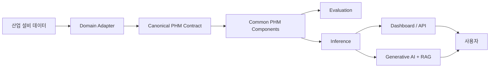
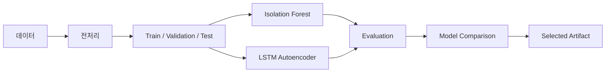
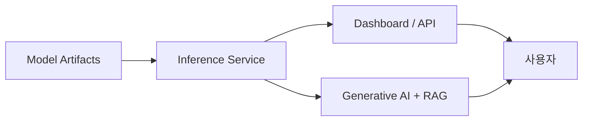

# Architecture Overview

이 문서는 `industrial-phm-framework`의 현재 reference architecture를 설명합니다.
특정 설비나 특정 데이터셋을 구조 자체에 고정하지 않고 책임과 데이터 흐름을 기준으로 유지합니다.

## 1. System Architecture

원천 산업 설비 데이터를 Domain Adapter가 공통 계약으로 변환하고, 이후 PHM 계층이 도메인별 파일 형식이나
컬럼 이름에 직접 의존하지 않도록 하는 것이 핵심 경계입니다.

## 2. Model Training and Evaluation

모델 학습과 평가는 분리합니다. Isolation Forest는 기준 모델, LSTM Autoencoder는 주요 시계열 이상 탐지
후보로 검증하되, 프레임워크 자체는 특정 알고리즘에 종속되지 않도록 설계합니다.

RUL은 모든 데이터셋에 강제하지 않습니다. 완전한 degradation/run-to-failure 정보가 없는 데이터에
인위적인 RUL target을 만들지 않습니다.

## 3. Service Architecture

서비스 계층은 학습 코드 자체를 직접 포함하지 않고 안정된 inference contract를 소비하도록 발전시킵니다.
생성형 AI 계층 역시 raw signal로 PHM 판정을 대신하지 않고 모델 결과, 추세, 근거 및 검색된 정비 문맥을
바탕으로 설명과 권고를 생성하는 역할을 갖습니다.

## Architectural Boundaries

현재 단계에서는 domain plugin 자동 탐색, workspace 분리, distributed training, model registry와 같은
확장 메커니즘을 구현하지 않습니다. 두 번째 실제 도메인을 통합하면서 필요성이 확인된 경우 ADR을 통해
도입 여부를 결정합니다.
