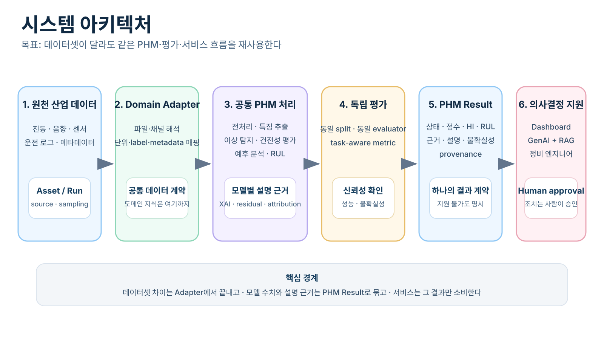
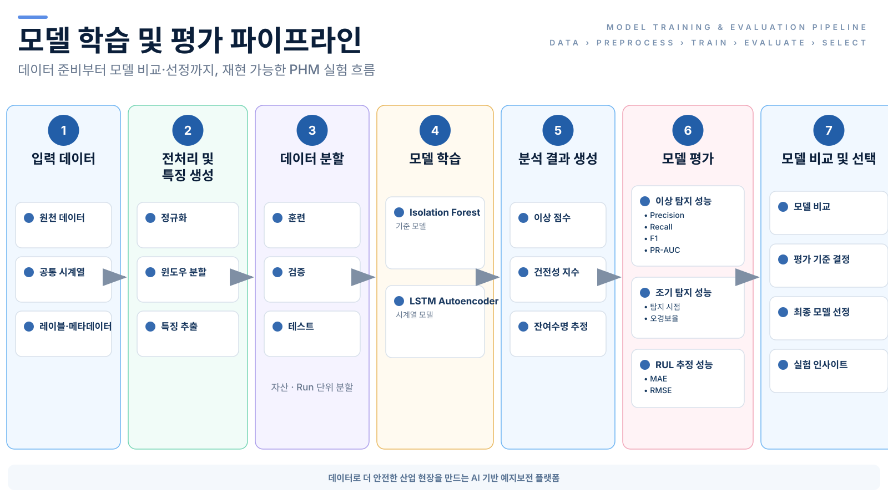
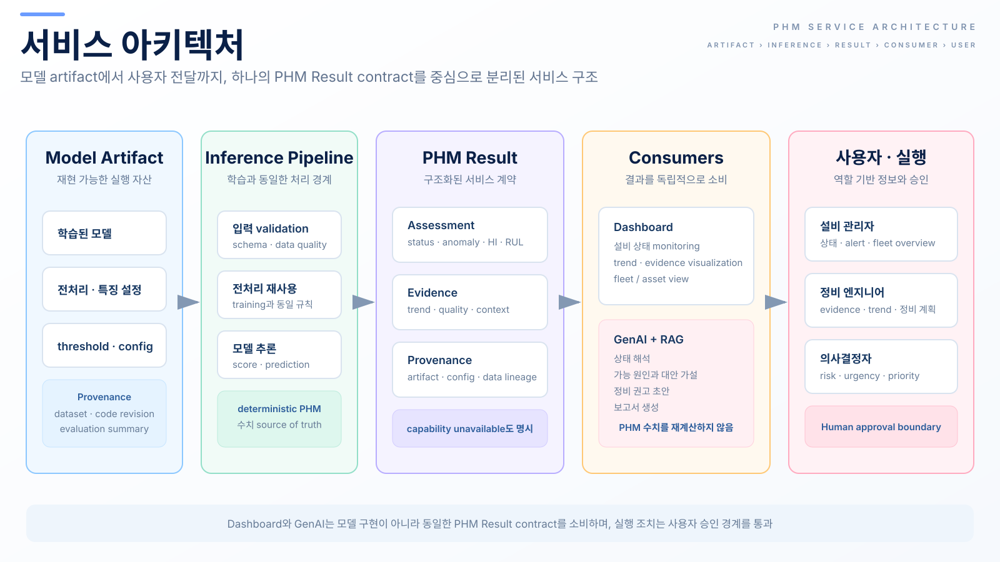

# Architecture Overview

이 문서는 `industrial-phm-framework`의 현재 reference architecture를 설명합니다.
특정 설비나 특정 데이터셋을 구조 자체에 고정하지 않고 책임과 데이터 흐름을 기준으로 유지합니다.

아키텍처 그림은 다음 질문에 빠르게 답하는 것을 우선합니다.

1. 데이터셋별 차이는 어디에서 다루는가?
2. 어떤 처리가 공통 PHM 기능으로 이어지는가?
3. 모델 학습과 평가는 어떤 흐름으로 구성되는가?
4. 분석 결과는 서비스와 생성형 AI에 어떻게 전달되는가?
5. 최종 사용자는 어떤 결과를 소비하는가?

`CanonicalTimeSeries`의 현재 가정, XJTU-SY에 과적합되지 않기 위한 확장 규칙, 실제 비공개/현장 데이터에서 확인할
quality·provenance·security boundary는
[`canonical-data-contract.md`](canonical-data-contract.md)를 기준으로 검토합니다. Canonical contract는 모든 산업
데이터를 미리 포괄하는 universal schema가 아니라 실제 source가 추가될 때 공통 의미만 유지하는 adapter/core
boundary입니다.

## 1. 시스템 아키텍처

원천 산업 설비 데이터는 Domain Adapter에서 공통 데이터 구조로 변환됩니다. 이후 공통 PHM 코어는
전처리·특징 생성, 이상 탐지, 건전성 평가, RUL 예측 등 데이터가 지원하는 PHM 기능을 수행하고,
평가 및 분석 계층에서 모델 성능과 결과를 검증합니다.

서비스 계층은 분석 결과를 API와 대시보드 등 사용자 접점으로 전달합니다. 생성형 AI는 PHM 모델의 수치
계산을 대신하지 않고, 계산된 분석 결과와 정비 지식을 바탕으로 설명·질의응답·정비 지원을 제공하는 상위
계층으로 취급합니다.

Isolation Forest와 LSTM Autoencoder는 현재 계획된 reference implementation이며 공통 PHM 코어 자체를
정의하지 않습니다. 다른 모델도 같은 책임 경계를 지키는 범위에서 교체·추가할 수 있어야 합니다.

## 2. 모델 학습 및 평가

그림은 입력 데이터에서 전처리·특징 생성, 데이터 분할, 모델 학습, 분석 결과 생성, 모델 평가, 비교·선택으로
이어지는 전체 실험 수명주기를 보여줍니다. 실제 split strategy는 deployment scenario와 데이터 구조에 맞게
asset/run/time/site/cohort 같은 leakage boundary를 명시적으로 정합니다. XJTU-SY의 bearing-run split을 모든
industrial dataset의 공통 split 규칙으로 일반화하지 않습니다.

그림의 `전처리 및 특징 생성`은 파이프라인 책임을 나타내는 개념 단계입니다. scaler, normalizer, threshold,
feature statistics처럼 데이터로부터 학습되는 상태는 split 이후 **train 범위에서만 fit**하고 validation/test에는
학습된 상태만 적용해야 합니다. 따라서 도식의 좌→우 순서를 "전체 데이터에 먼저 fit한다"는 의미로 해석하지
않습니다.

모델 평가는 모델 구현과 분리합니다. Isolation Forest와 LSTM Autoencoder를 비교할 때도 같은 split과 같은
평가 프로토콜을 사용합니다. anomaly, early detection, prognostics 지표는 데이터가 실제로 지원하는 capability와
ground truth가 정의된 경우에만 사용합니다.

## 3. 서비스 아키텍처

학습된 모델 산출물은 추론 서비스에서 사용되고, 추론 결과는 결과 API를 통해 대시보드와 생성형 AI 등 상위
소비자에게 전달됩니다. 현재 도식의 `분석 결과 공유`는 대시보드와 생성형 AI가 동일한 분석 context를 활용할 수
있다는 의미이며, 한쪽이 다른 쪽의 필수 선행 계층이라는 의미는 아닙니다.

향후 실제 inference 결과가 두 종류 이상의 모델에서 안정적으로 확인되면 구조화된 `PHMResult` 계약으로 결과
payload를 명시할 예정입니다. 그 전까지는 문서에서 미래 schema를 확정하거나 그림에 임의 필드를 추가하지
않습니다.

생성형 AI는 상태 해석, 가능한 원인 정리, 정비 권고 초안과 보고서 생성을 지원할 수 있지만 PHM 수치를 다시
계산하는 source of truth가 되지 않습니다. 실제 정비 작업이나 설비 제어로 이어지는 조치는 별도의 사용자 승인
및 운영 절차를 거쳐야 합니다.

## 아키텍처 자산 Source of Truth

세 아키텍처 그림은 `assets/*.svg`가 canonical source입니다. PNG/WebP 복제본을 병행 관리하지 않으며,
CI에서 SVG 구조와 README/architecture 문서 참조를 검증합니다.

그림은 구조 또는 책임이 실제로 바뀔 때 수정합니다. 시각적 단순화를 위해 이미 검토된 단계나 관계를 임의로
삭제하지 않으며, 가독성 검수는 원본 크기뿐 아니라 README 축소 렌더링에서도 수행합니다.
